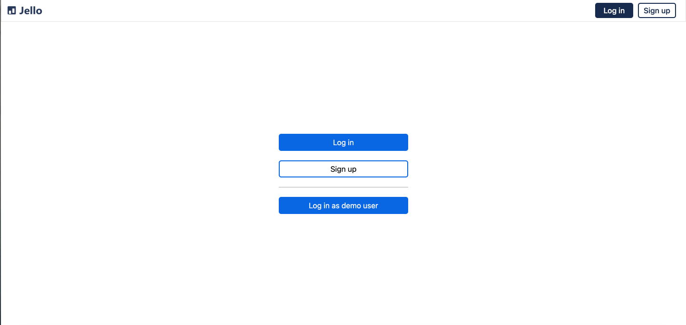
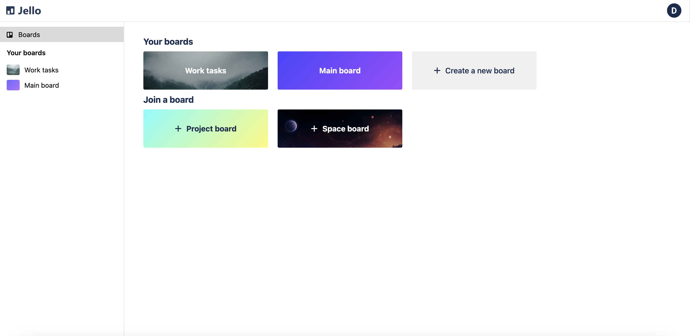
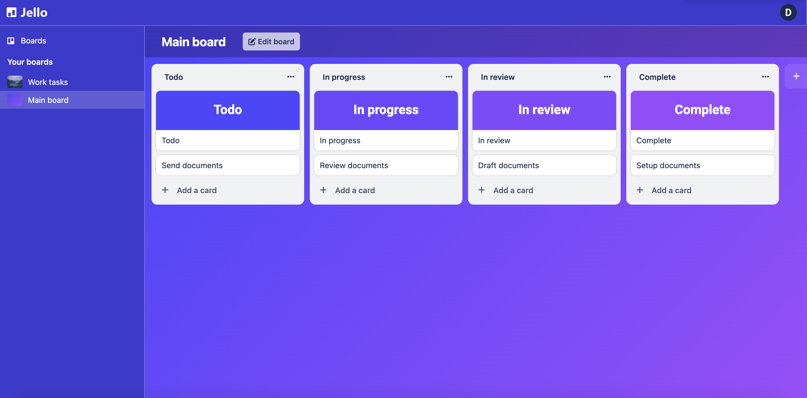

# 
This is a clone of the organization website Trello (named Jello). The site works as a kanban-style task management system, featuring Atlassian's drag and drop library.

[Live demo link](https://workspace-deployed.onrender.com/)

## Technologies used
<div>
   
   
   &nbsp;
   &nbsp;
   &nbsp;
   &nbsp;
   &nbsp;
   &nbsp;
   &nbsp;
   
</div>

## Getting started

1. Clone this repository.

2. Install dependencies.

   ```bash
   pipenv install -r requirements.txt
   ```

3. Create a __.env__ file based on the example with proper settings for your
   development environment.

4. Make sure the SQLite3 database connection URL is in the __.env__ file.

5. Replace the value for
   `SCHEMA` with a unique name, **making sure you use the snake_case
   convention.**

6. Get into your pipenv, migrate your database, seed your database, and run your
   Flask app (back in root folder):

   ```bash
   pipenv shell
   ```

   ```bash
   flask db upgrade
   ```

   ```bash
   flask seed all
   ```

   ```bash
   flask run
   ```

   The backend will run on port 8000 by default.

7. To run the React frontend in development, open a new terminal instance and `cd` into the __react-vite__
   directory and run `npm i` to install dependencies. Next, run `npm run build`
   to create the `dist` folder. Finally, run `npm run dev` to launch the frontend in your local browser.

   ## Application screenshots

   ### Landing Page
   
   From this page, a user may log in, sign up, or automatically log in as a demo user.

   ### Dashboard
   
   Here, a user can view all boards they have joined, as well as any public boards they haven't joined. Clicking on a joined board will navigate to that board's page. Clicking on an unjoined board with join it. The user can also create a board from this page (in a popup), giving it a name, description, theme and visibility setting.


   ### Board Page
   
   On this page, the user can view and manipulate a board's lists and cards. Lists and cards can be dragged around and reorganized. Cards also can be given labels, descriptions, images, and assignments. On this page a user may also edit the board's proprties.  


   ## Sample Endpoints

| Request                | Purpose                                                                                                                                            | Return value                                                                                                                                                                      |
|------------------------|----------------------------------------------------------------------------------------------------------------------------------------------------|-----------------------------------------------------------------------------------------------------------------------------------------------------------------------------------|
| GET /api/boards        | Upon login, fetch all public or user-owned boards. These boards do not have associated lists and cards in the return.                              | {boards: { 1: {  description: STRING, id: INT, name: STRING. list_order: STRING, owner_id: INT, public: BOOL, theme: { id: INT, ... } users: {  1: { id: INT ... } } } 2: {...} } |
| POST /api/boards       | Creates a new board, returning that board. The new board should immediately become visible in the dashboard and in the sidebar.                    | {   description: STRING, id: INT, name: STRING. list_order: STRING, owner_id: INT, public: BOOL, theme: { id: INT, ... } users: {  1: { id: INT ... } } }                         |
| PUT /api/cards/:cardId | Updates a card, specified by the cardId. Updatable attributes include name, description, labels, and image. Returns the card's updated attributes. | { id: INT, name: STRING, description: STRING, image_url: STRING, label: STRING, list_id: INT }                                                                                    |


## Future features
* User-generated themes
* Card comments
* Card priority
